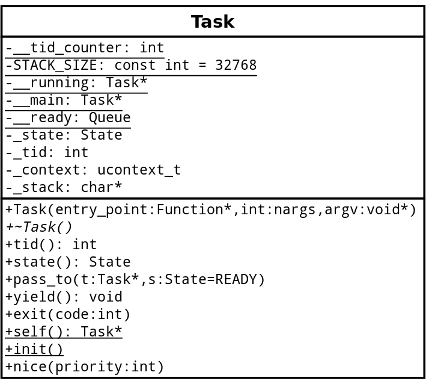

## Recommended for 24/05: \[Problem Solving\] (SP3) Solve problem based on the unit "Processes and Threads"
**Due date:** terça, 28 junho 2016, 11:55

**Requested files:** `Queue.cc`, `Queue.h`, `Task.cc`, `Task.h`

**Maximum number of files:** 9

**Maximum upload file size:** 128 KiB

**Type of work:** Group work SP3 - Agrupamento 1: Grupo Único.

##### Esta é a avaliação de 'Solução de Problemas 3" (SP3).

Ela é uma avaliação extra classe em grupos (mesmo agrupamento) realizada em algumas horas (~2 a ~10) e corresponde basicamente a um exercício de programação encontrado na bibliografia, ao final de alguns capítulos. Ala avalia as "habilidades" dos acadêmicos na resolução de problemas práticos envolvendo os conhecimentos teóricos estudados, e também suas "habilidades" em projetar, modelar, simular, implementar e avaliar os principais componentes de um sistema operacional. Das cerca de 4 soluções de problemas realizadas, será desconsiderada aquela com menor nota.

A Solução de Problemas deve ser realziada exclusivamente através do editor de programas do Moodle, em grupos, e é avaliada conforme os seguintes critérios:
- (i) corretude e funcionamento do programa implementado, que deve seguir rigorosamente a descrição fornecida, resolvendo o problema proposto sem travamentos ou comportamentos inesperados;
- (ii) o projeto e modelagem do código orientado a objetos e as estruturas de dados utilizados;
- (iii) a documentação do sistema, conforme doxigen, realizada ao longo do código,
- (iv)  a capacidade de cooperar e trabalhar em grupo e a utilização de práticas de estudo independente e atitudes profissionais e éticas. Também será observada a análise de "Similaridade" realizada automaticamente pelo Moodle, e trabalhos copiados receberão nota zero. O restante deste texto descreve o que deve ser feito nesta Atividade Prática.

PS: O professor ainda está criando o mecanismo para execução e correção automática desta atividade.

### SP3  — User Level Process Scheduler

Neste trabalho de "Solução de Problemas" deve-se estender a classe "**Queue**" com a construção de uma classe para abstrair processos em nível de usuários - na prática, threads. A classe implementada será chamada de **Task** (tarefa). Lembre-se que uma classe é uma estrutura de dados, logo, nossa classe **Task** será o PCB (**Proccess Control Block**) do sistema. A partir dessa descrição será disponibilizado um gabarito em C++ como no código abaixo, geralmente incompleto, e um diagrama UML de uma versão completa da solução, como na imagem abaixo.



```c++
/*
 * Task.h
 *
 *  Created on: Aug 15, 2014
 *      
 */
 
#ifndef TASK_H_
#define TASK_H_
 
#include <Queue.h>
#include <ucontext.h>
 
namespace BOOOS {
 
class Task : public Queue::Element {
public:
    enum State {
        READY,
        WAITING,
        RUNNING,
        FINISHING
    };
 
    Task(void (*entry_point)(void *), int nargs, void * arg);
    virtual ~Task();
 
    int tid() { return _tid; }
    State state() { return _state; }
 
    void pass_to(Task * t, State s = READY);
 
    void exit(int code);
 
    static Task * self() { return (Task*)__running; }
    static void init();
 
private:
    static volatile Task * __running;
 
    State _state;
    int _tid; // task ID
    // ...
};
 
} /* namespace BOOOS */
 
#endif /* TASK_H_ */
```

Os métodos de interface (i.e., os _públicos_) que precisam ser implementados na classe estão na declaração acima. Não altere a assinatura desses métodos! Observe que você certamente precisará de novos atributos para o correto funcionamento da classe, e seria bom utilizar alguns métodos privados para auxiliar na implementação. Você pode criar métodos e atributos _privados_ à vontade. 

Uma das principais responsabilidades do seu trabalho é realizar a troca de contexto entre as Tasks em nível de usuário. Seu PCB deve ser capaz de armazenar o contexto (`ucontext_t`) daquela tarefa e o salvamento e retorno de contextos de execução pode ser realizado com o apoio de uma biblioteca em C para a troca de contexto. Abaixo são apresentados alguns links de apoio para você buscar compreender seu funcionamento.

- http://en.wikipedia.org/wiki/Setcontext
- http://pubs.opengroup.org/onlinepubs/007908799/xsh/ucontext.h.html
- http://www.opensource.apple.com/source/xnu/xnu-1456.1.26/bsd/sys/ucontext.h

Todos os arquivos necessários para que desenvolva esse trabalho prático estão disponíveis no próprio VPL. Sugere-se apenas que você substitua o arquivo `Queue.cc` por sua própria implementação da fila (seguindo a mesma interface pública), pois o arquivo disponibilizado está vazio.

O teste no arquivo `test/Task_Test.cc` implementa uma aplicação para testar sua classe Task. Use este exemplo como teste inicial. Abaixo há uma descrição detalhada dos métodos de interface da classe.

  **Task(void (*entry_point)(void *), int nargs, void * arg):** construtor - deve inicializar todos os atributos dos objetos.
  
  **virtual ~Task():** destrutor - deve liberar recursos alocados pelo construtor (new/malloc).
  
  **int tid():** getter do Task ID (_tid).
  
  **State state():** getter do estado do processo (_state).
  
  **void pass_to(Task * t, State s = READY):** este método salva o contexto do objeto (this) e carrega o contexto da Task recebida por parâmetro. O estado passado em s é o novo estado do objeto que está deixando a CPU. _Há algum atributo de classe (static) que precisa ser atualizado aqui?_

  **void exit(int code):** finaliza a Task (this) e configura o valor de resultado da task com o valor de code. Por enquanto, se preocupem em fazer a Task retornar a execução para a main. Ignorem o parâmetro code agora - utilizaremos ele mais adiante.

  **static Task * self():** método de classe (static) que retorna a Task executando no momento.

  **static void init():** método de classe que precisa ser chamando na inicialização do sistema e deve inicializar os atributos de classe (static). **Atenção, o atributo __main, que é static, deve ser inicializado aqui!**

## Requested files

### Queue.cc

```c++
    1 /*
    2  * BOOOS.h
    3  *
    4  */
    5 
    6 #include "Queue.h"
    7 
    8 namespace BOOOS {
    9 
   10 
   11 // Queue constructor: must initialize queue's attributes
   12 Queue::Queue() {
   13 
   14 }
   15 
   16 // Queue destructor: must finalize queue's attributes
   17 Queue::~Queue() {
   18 
   19 }
   20 
   21 // insert method: must insert the Element at the end of the queue
   22 // Error messages:
   23 //   01: invalid Element (if elem == 0)
   24 //   02: duplicated Element (if elem already is on the queue)
   25 void Queue::insert(Queue::Element * elem) {
   26 
   27 }
   28 
   29 // remove: must search and remove the element from the queue
   30 // Error messages:
   31 //   01: queue is empty
   32 Queue::Element * Queue::remove() {
   33 
   34 }
   35 
   36 }
```

### Scheduler.h

```c++
/*
 * File:   Scheduler.h
 * Author: <PREENCHER>
 *
 * Created on September 27, 2015, 11:19 AM
 */

#ifndef SCHEDULER_H
#define   SCHEDULER_H

#include "Thread.h"
#include "Scheduling_Queue.h"

#include <queue>

class Scheduler {
public:
    Scheduler();

    Scheduler(const Scheduler& orig) {

    }

    virtual ~Scheduler() {

    }
private:
    Scheduling_Queue* _readyQueue;
    Thread* _choosen;
public:
    static const bool preemptive = true;
public:
    Thread* choose();  // choose a new thread to run
    Thread* choosen(); // returns the last chosen thread (syntax error: the method should be called chosen)
    void reschedule();
    void insert(Thread* thread);
    Thread* remove(Thread* thread);
};

#endif    /* SCHEDULER_H */
```

### Queue.h

```c++
    1 /*
    2  * BOOOS.h
    3  *
    4  */
    5 
    6 #ifndef QUEUE_H_
    7 #define QUEUE_H_
    8 
    9 namespace BOOOS {
   10 
   11         class Queue {
   12         public:
   13                 Queue();
   14                 virtual ~Queue();
   15 
   16                 class Element {
   17                 public:
   18                         Element() { _prev = 0; _next = 0; _rank = 0; }
   19                         virtual ~Element() {}
   20 
   21                         Element * prev() { return _prev; }
   22                         Element * next() { return _next; }
   23                         int rank() { return _rank; }
   24                         void prev(Element * p) { _prev = p; }
   25                         void next(Element * p) { _next = p; }
   26                         void rank(int r) { _rank = r; }
   27 
   28                 private:
   29                         Element * _prev;
   30                         Element * _next;
   31                         int _rank;
   32                 };
   33 
   34                 Element * head() { return &_head; }
   35 
   36                 int length() { return _length; }
   37 
   38                 void insert(Element * elem);
   39                 void insert_ordered(Element * elem);
   40 
   41                 Element * remove();
   42                 void remove(Element * e);
   43 
   44         private:
   45                 Element * search(Element * elem);
   46 
   47                 Element _head; // _head.next will point to head, _head.prev will point to tail
   48                 int _length;
   49         };
   50 
   51 }
   52 
   53 #endif /* QUEUE_H_ */
```

### Task.cc

```c++
    1 /*
    2  * Task.cc
    3  *
    4  */
    5 
    6 #include "Task.h"
    7 
    8 namespace BOOOS
    9 {
   10 
   11 volatile Task * Task::__running;
   12 
   13 //...
   14 
   15 } /* namespace BOOOS */
```

### Task.h

```c++
    1 /*
    2  * Task.h
    3  *
    4  */
    5 
    6 #ifndef TASK_H_
    7 #define TASK_H_
    8 
    9 #include <Queue.h>
   10 #include <ucontext.h>
   11 
   12 namespace BOOOS {
   13 
   14 class Task : public Queue::Element {
   15 public:
   16   enum State {
   17       READY,
   18       WAITING,
   19       RUNNING,
   20       FINISHING
   21   };
   22 
   23   Task(void (*entry_point)(void), int nargs, void * arg);
   24   virtual ~Task();
   25 
   26   int tid() { return _tid; }
   27   State state() { return _state; }
   28 
   29   void pass_to(Task * t, State s = READY);
   30 
   31   void exit(int code);
   32 
   33   static Task * self() { return (Task*) __running; }
   34   static void init();
   35 
   36 private:
   37 
   38   Task();
   39 
   40   static volatile Task * __running;
   41 
   42   State _state;
   43   int _tid; // task ID
   44   // ...
   45 };
   46 
   47 } /* namespace BOOOS */
   48 
   49 #endif /* TASK_H_ */
```
