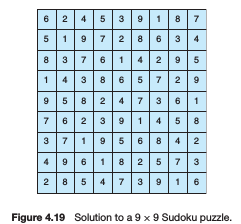
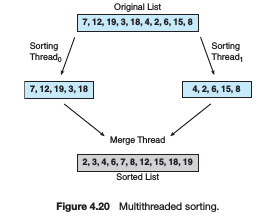

## Recommended for 19/04: \[Problem Solving\] (SP1) Solve problem based on the unit "Foundamentals of Operating Systems"

**Due date:** terça, 28 junho 2016, 11:55

**Maximum number of files:** 4
**Maximum upload file size:** 128 KiB
**Type of work:** Group work SP1 - Agrupamento 1: Grupo Único.

##### Esta é a avaliação de "Solução de Problemas 1" (SP1).

Ela é uma avaliação extra classe em grupos (mesmo agrupamento) realizada em algumas horas (~2 a ~10) e corresponde basicamente a um exercício de programação encontrado na bibliografia, ao final de alguns capítulos. Ela avalia as "habilidades" dos acadêmicos na resolução de problemas práticos envolvendo os conhecimentos teóricos estudados, e também suas "habilidades" em projetar, modelar, simular, implementar e avaliar os principais componentes de um sistema operacional. Das cerca de 4 soluções de problemas realizadas, será desconsiderada aquela com menor nota.

A Solução de Problemas deve ser realziada exclusivamente através do editor de programas do Moodle, em grupos, e é avaliada conforme os seguintes critérios:
* (i) corretude e funcionamento do programa implementado, que deve seguir rigorosamente a descrição fornecida, resolvendo o problema proposto sem travamentos ou comportamentos inesperados;
* (ii) o projeto e modelagem do código orientado a objetos e as estruturas de dados utilizados;
* (iii) a documentação do sistema, conforme doxigen, realizada ao longo do código,
* (iv) a capacidade de cooperar e trabalhar em grupo e a utilização de práticas de estudo independente e atitudes profissionais e éticas. Também será observada a análise de "Similaridade" realizada automaticamente pelo Moodle, e trabalhos copiados receberão nota zero. O restante deste texto descreve o que deve ser feito nesta Atividade Prática.

### SP1  —Sudoku Solution Validator

A Sudoku puzzle uses a 9 × 9 grid in which each column and row, as well as each of the nine 3 × 3 subgrids, must contain all of the digits 1 · · · 9. Figure 4.19 presents an example of a valid Sudoku puzzle. This project consists of designing a multithreaded application that determines whether the solution to a Sudoku puzzle is valid.

##### There are several different ways of multithreading this application. One suggested strategy is to create threads that check the following criteria:

* A thread to check that each column contains the digits 1 through 9
* A thread to check that each row contains the digits 1 through 9
* Nine threads to check that each of the 3 × 3 subgrids contains the digits 1 through 9

  

 columns, you could create nine separate threads and have each of them check one column.

### Passing Parameters to Each Thread

The parent thread will create the worker threads, passing each worker the location that it must check in the Sudoku grid. This step will require passing several parameters to each thread. The easiest approach is to create a data structure using a struct. For example, a structure to pass the row and column where a thread must begin validating would appear as follows:

```c++
/* structure for passing data to threads */
typedef struct
{
int row;
int column;
} parameters;
```

Both Pthreads and Windows programs will create worker threads using a strategy similar to that shown below:

```c++
parameters *data = (parameters *) malloc(sizeof(parameters));
data->row = 1;
data->column = 1;
/* Now create the thread passing it data as a parameter */
```

The data pointer will be passed to either the pthread create() (Pthreads) function or the CreateThread() (Windows) function, which in turn will pass it as a parameter to the function that is to run as a separate thread.

### Returning Results to the Parent Thread

Each worker thread is assigned the task of determining the validity of a particular region of the Sudoku puzzle. Once a worker has performed this check, it must pass its results back to the parent. One good way to handle this is to create an array of integer values that is visible to each thread. The i th index in this array corresponds to the i th worker thread. If a worker sets its corresponding value to 1, it is indicating that its region of the Sudoku puzzle is valid. A value of 0 would indicate otherwise. When all worker threads have completed, the parent thread checks each entry in the result array to determine if the Sudoku puzzle is valid.


